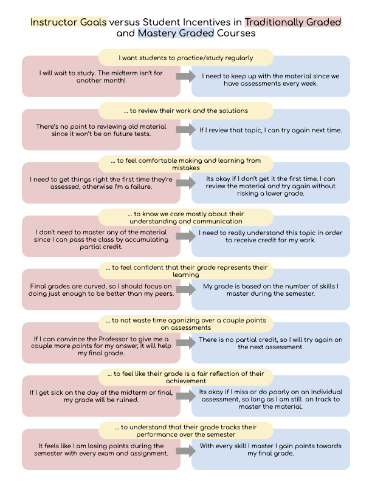

# MasteryLearningApp
This is a highly opinionated version of the older SpecsGradingApp

See the [documentation](./doc/README.md)

The key idea is that the MasteryLearningApp makes it relatively easy for faculty to teach using the Mastery Assessment Pedagogy which consists of the following four practices:

1. Building a list of measureable skills and a library of challenging problems for that skill. The Mastery Learning App make it easy to share skill lists and skill-based problem libraries between courses and instructors.
2. Creating and proctoring personalized exams (and possibly personalized makeup exams) every week,
  with one challenging question for each skill
3. Rapidly grading the personalized exams so students can see which skills they must study for next week. 
  Students only have to answer questions on skills they haven't yet mastered.
4. Clearly communicating to the students which skills they have mastered and which they have not.

Here is a poster showing the ways that the Mastery Learning App incentivizes students to adopt the learning practices that instructor feel are most effective!

